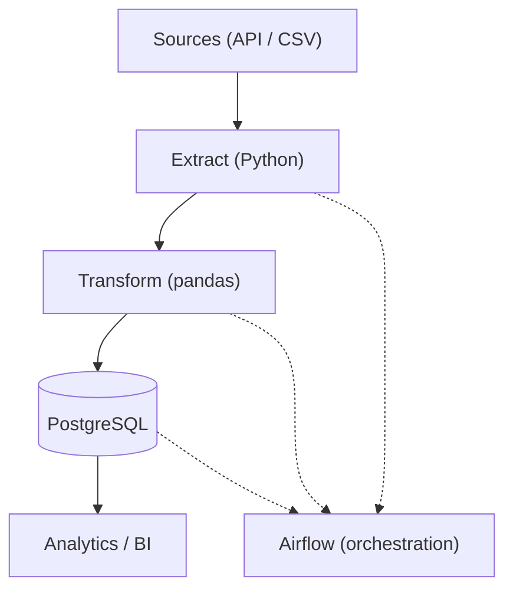
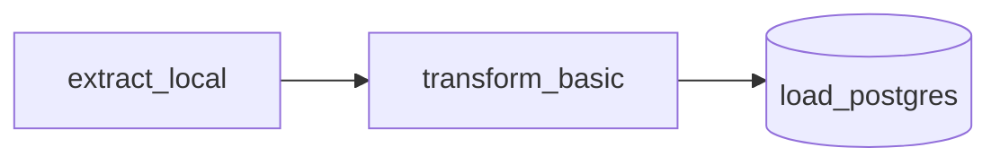

# ☁️ CloudFlow ETL (GCP-style, Free Tier)


Airflow-orchestrated ETL built to run locally on free tier. **Extract → Transform → (optional) Load to Postgres**, with GCP-style structure (`dags/`, `src/`, `sql/`, `data/`) and a Docker Compose quickstart. Includes sample data, schema, and a basic DAG to showcase pipeline design for Data Engineering roles.

---

## 🧱 Architecture (Mermaid)



## 🔁 DAG Flow (Mermaid)



---

## 🛠 Tech Stack

| Layer           | Tech                         |
|-----------------|------------------------------|
| Orchestration   | Apache Airflow               |
| Processing      | Python (pandas)              |
| Storage         | CSV / JSON (local)           |
| Warehouse (opt) | PostgreSQL + SQLAlchemy      |
| Infra (opt)     | Docker Compose               |

---

## ✨ Features

- Minimal, **runnable** local ETL (no cloud account required)
- GCP-style layout (`dags/`, `sql/`, `src/{extract,transform,load}`)
- Sample schema (`events`) and seed data
- Optional Postgres **load** step (via SQLAlchemy)
- Easy to extend to real APIs / cloud providers

---

## 🚀 Quickstart (Local)

```bash
# 1) install deps
pip install -r requirements.txt

# 2) run extract / transform
python src/extract/extract_local.py
python src/transform/transform_basic.py

# 3) (optional) load to Postgres
# - start local Postgres
# - copy .env.example to .env and set creds
python src/load/load_postgres.py
```

### Optional: Airflow quick demo (Docker)

```bash
# start Airflow web UI (port 8080)
docker compose up
# login: admin / admin
# unpause DAG: cloudflow_basic_etl
```

---

## 📁 Project Structure

```
cloudflow-etl-gcp/
├─ dags/
│  └─ basic_etl_dag.py
├─ src/
│  ├─ extract/extract_local.py
│  ├─ transform/transform_basic.py
│  └─ load/load_postgres.py
├─ data/
│  ├─ raw/
│  └─ processed/
├─ sql/
│  └─ schema.sql
├─ docs/
├─ .github/workflows/
├─ .env.example
├─ requirements.txt
├─ docker-compose.yml
└─ README.md
```

---

## 🔮 Next Ideas

- Swap local seed with a real API (with retries/backoff)
- Add data quality checks (Great Expectations)
- Turn load step on in DAG and schedule daily
- Containerize Postgres for fully reproducible demo

---

## 🧾 License

MIT — see `LICENSE`.
