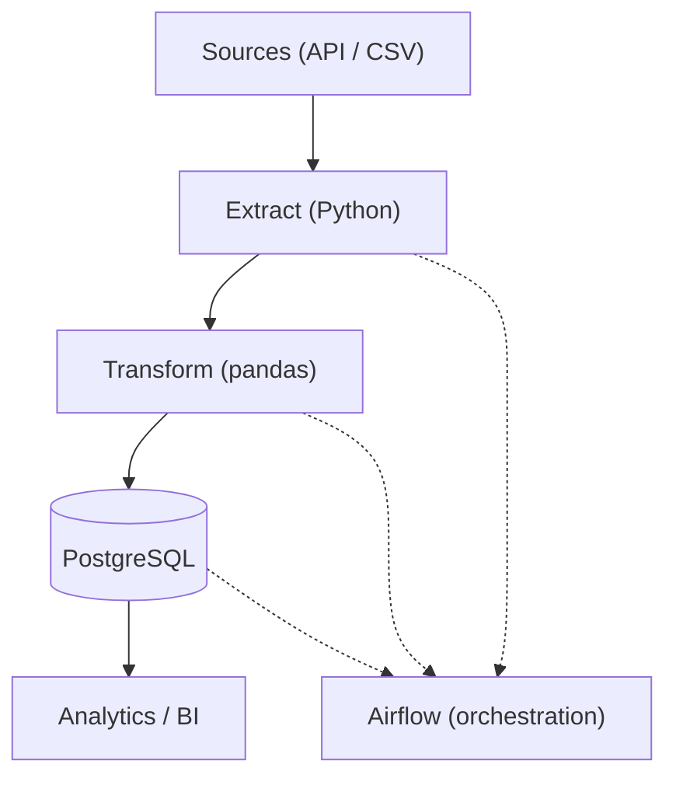

# ☁️ CloudFlow ETL (GCP-style, Free Tier)

Airflow-orchestrated ETL built to run locally on free tier. **Extract → Transform → (optional) Load to Postgres**, with GCP-style structure (`dags/`, `src/`, `sql/`, `data/`) and a Docker Compose quickstart. Includes sample data, schema, and a basic DAG to showcase pipeline design for Data Engineering roles.

---

## 🧱 Architecture (Mermaid)

